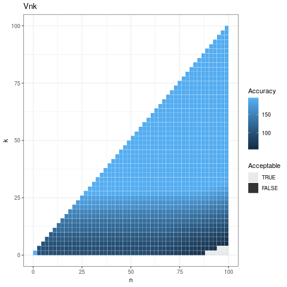

Computing clusters prior distribution for Gibbs-type processes. This is an anonymised version for reviewing purposes.

## Introduction


The following reference gives an overview of Gibbs-type priors and their importance for Bayesian Nonparametrics:

De Blasi, Pierpaolo, Stefano Favaro, Antonio Lijoi, Ramsés H. Mena, Igor Prünster, and Matteo Ruggiero. “Are Gibbs-Type Priors the Most Natural Generalization of the Dirichlet Process?” IEEE Transactions on Pattern Analysis and Machine Intelligence 37, no. 2 (2015): 212–29. https://doi.org/10.1109/TPAMI.2013.217.


## How to install the package

The package is developed for Julia 1.5. Much of its functionality rests on the 'Arb' package[1], via its interface in `Nemo.jl`.

Press `]` in the Julia interpreter to enter the Pkg mode and input:

```julia
pkg> add https://github.com/konkam/GibbsTypePriors
```


Alternatively, you may run:

```julia
julia> using Pkg; Pkg.add(url = "https://github.com/konkam/GibbsTypePriors")
```


# How to use the package

To compute the prior density at clusters of size k=10 for a Normalized Generalised Gamma process of parameters σ=0.8, β = 1.2 and n = 500 data points, use:


```julia
using GibbsTypePriors
Pkn_NGG(10, 500, 1.2, 0.8)
```

```
8.984618037609138e-11
```


The same may be done for the 2-parameter Poisson Dirichlet, also named the Pitman-Yor process:

```julia
Pkn_PY(10, 500, 1.2, 0.8)
```

```
2.562372640654159e-5
```


We also provide the same function for the Dirichlet process:

```julia
Pkn_Dirichlet(10, 500, 1.2)
```

```
0.09844487393917364
```


# Illustration of the various priors:

The following figure shows a comparison of the priors distribution on the number of clusters induced by a Dirichlet process, a 2-parameter Poisson-Dirichlet process and a Normalised Inverse Gamma process.

```julia
using GibbsTypePriors, DataFrames, DataFramesMeta, RCall
R"library(tidyverse)"

R"p = ggplot(data.frame(x = 1:50,
                        Pkn_NGG = $(Pkn_NGG.(1:50, 50, 48.4185, 0.25)),
                        Pkn_NGG2 = $(Pkn_NGG.(1:50, 50, 1., 0.7353)),
                        Pkn_Dirichlet = $(Pkn_Dirichlet.(1:50, 50, 19.233)),
                        Pkn_2PD = $(Pkn_2PD.(1:50, 50, 12.2157, 0.25)),
                        Pkn_2PD2 = $(Pkn_2PD.(1:50, 50, 1., 0.73001))
                    ) %>%
            gather(Process_type, density, Pkn_NGG:Pkn_2PD2),
    aes(x=x, y = density, colour = Process_type)) +
geom_line() +
ggthemes::scale_colour_ptol() +
theme_minimal()"
R"png('Illustration.png')
plot(p)
dev.off()"
```


 

References:
[1] Johansson, F. (2017).  Arb:  efficient arbitrary-precision midpoint-radius interval arithmetic.IEEE Transactions on Computers, 66:1281–1292.


# Appendix

## Varying the precision of the calculation

For experimental purposes or if you happen to reach the limits of numerical accuracy with the default precision of the package (5000 bits), we provide special functions allowing to change the number of bits used for the computation:

```julia
using Nemo
GibbsTypePriors.Cnk(6, 5, 0.5) |> Nemo.accuracy_bits
```

```
4997
```


```julia
GibbsTypePriors.Cnk(6, 5, 0.5, 200) |> Nemo.accuracy_bits
```

```
197
```


```julia
GibbsTypePriors.Vnk_NGG(100,50, 0.5, 0.2) |> Nemo.accuracy_bits
```

```
4992
```


```julia
GibbsTypePriors.Vnk_NGG(100,50, 0.5, 0.2, 200) |> Nemo.accuracy_bits
```

```
192
```


```julia
GibbsTypePriors.Pkn_NGG_arb(50, 100, 0.5, 0.2) |> Nemo.accuracy_bits
```

```
4913
```


```julia
GibbsTypePriors.Pkn_NGG_arb(50, 100, 0.5, 0.2, 200) |> Nemo.accuracy_bits
```

```
112
```


## Instability of the $V_{n,k}$

```julia
using GibbsTypePriors, Nemo, DataFrames, DataFramesMeta, RCall
β = 0.5
σ = 0.2
to_plot = [[(n,k) for k in 1:2:n]  for n in 1:2:100] |>
  l -> vcat(l...) |>
  ar -> [DataFrame(n = val[1], k = val[2], acc = GibbsTypePriors.Vnk_NGG(val[1], val[2], β, σ, 200) |> Nemo.accuracy_bits) for val in ar] |>
  l -> vcat(l...)

R"library(tidyverse)"
p = R"$to_plot %>%
    as_tibble %>%
    mutate(Acceptable = factor(acc < 64, levels = c(TRUE, FALSE))) %>%
    ggplot(aes(x = n, y = k, fill = acc, alpha = Acceptable)) + 
      geom_tile(colour = 'white') + 
      theme_bw() + 
      scale_fill_gradient(name = 'Accuracy') + 
      ggtitle('Vnk')"
R"png('figures/Vnk_instability.png')
  plot($p)
  dev.off()"
```




Accuracy (bits) of the computed $V_{n,k}$ as a function of $n$ and $k$. The computations are carried out using 200 bits of precision. Light coloured areas correspond to where the precision decreases below 64 bits.
